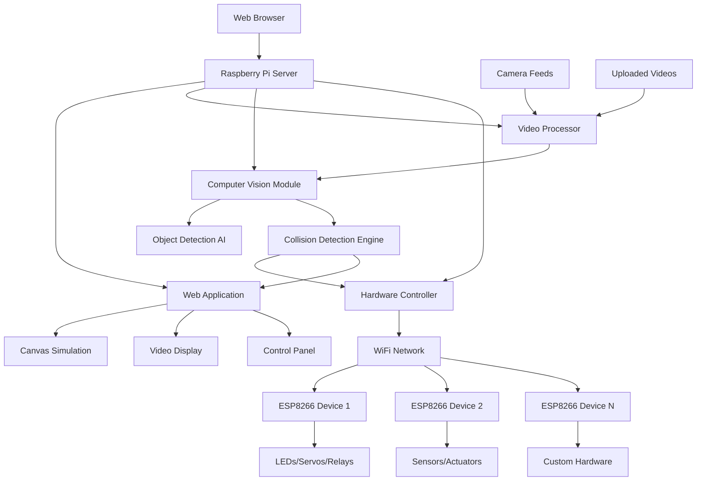

# Design Document: Collision Detection System with IoT Integration

## Overview

The collision detection system is a comprehensive platform that combines web-based simulation, computer vision, and IoT hardware control. The system processes both simulated objects and real-world video feeds to detect collisions, providing immediate visual feedback and triggering physical responses through ESP8266 devices.

The architecture centers around a Raspberry Pi as the edge computing hub, running computer vision algorithms for video analysis while coordinating between a web interface and distributed ESP8266 hardware controllers. The system supports both uploaded video analysis and real-time camera feed processing, making it suitable for both forensic analysis and live monitoring applications.

## Architecture

The system uses a distributed architecture with clear separation between web interface, video processing, and hardware control:



The system follows a microservices pattern where each component can operate independently while communicating through well-defined APIs.

## Components and Interfaces

### Web Application Layer

**GameEngine Class** (Browser)
```javascript
class GameEngine {
  constructor(canvas)
  start()
  stop()
  update(deltaTime)
  render()
  addObject(gameObject)
  removeObject(gameObject)
}
```

**VideoUploader Class** (Browser)
```javascript
class VideoUploader {
  constructor(uploadElement)
  uploadVideo(file)
  getUploadProgress()
  onUploadComplete(callback)
}
```

**LiveFeedViewer Class** (Browser)
```javascript
class LiveFeedViewer {
  constructor(videoElement)
  connectToFeed(streamUrl)
  displayCollisionOverlay(detections)
  onCollisionDetected(callback)
}
```

### Raspberry Pi Server Layer

**VideoProcessor Class** (Python)
```python
class VideoProcessor:
    def __init__(self, cv_module)
    def process_uploaded_video(self, video_path)
    def process_camera_feed(self, camera_id)
    def get_processing_status(self)
    def stop_processing(self)
```

**ComputerVisionModule Class** (Python)
```python
class ComputerVisionModule:
    def __init__(self, model_path)
    def detect_objects(self, frame)
    def track_objects(self, detections, previous_tracks)
    def calculate_velocities(self, tracks)
    def predict_collisions(self, tracks)
```

**CollisionEngine Class** (Python)
```python
class CollisionEngine:
    def __init__(self, cv_module, hardware_controller)
    def analyze_frame(self, frame, timestamp)
    def detect_collisions(self, objects)
    def trigger_responses(self, collision_events)
    def log_collision(self, event)
```

**HardwareController Class** (Python)
```python
class HardwareController:
    def __init__(self, device_config)
    def connect_devices(self)
    def send_command(self, device_id, command)
    def get_device_status(self, device_id)
    def broadcast_alert(self, message)
```

### ESP8266 Device Layer

**DeviceController Class** (C++)
```cpp
class DeviceController {
  public:
    DeviceController(String deviceId);
    void connectWiFi(String ssid, String password);
    void setupHardware();
    void handleCommand(String command);
    void sendStatus();
    void executeAction(ActionType action, int intensity);
};
```

### Data Models

**DetectedObject Structure**
```python
@dataclass
class DetectedObject:
    id: str
    class_name: str
    confidence: float
    bounding_box: BoundingBox
    velocity: Vector2D
    timestamp: float
```

**CollisionEvent Structure**
```python
@dataclass
class CollisionEvent:
    id: str
    object1: DetectedObject
    object2: DetectedObject
    collision_point: Vector2D
    timestamp: float
    severity: float
    video_source: str
```

**HardwareCommand Structure**
```python
@dataclass
class HardwareCommand:
    device_id: str
    action: str
    parameters: Dict[str, Any]
    timestamp: float
    priority: int
```

**VideoAnalysisResult Structure**
```python
@dataclass
class VideoAnalysisResult:
    video_id: str
    total_frames: int
    processed_frames: int
    collision_events: List[CollisionEvent]
    processing_time: float
    confidence_scores: List[float]
```
```

## Data Models

The system manages data across multiple layers and technologies:

**Raspberry Pi Data Management**
- Video processing queues and frame buffers
- Object tracking state across video frames
- Hardware device registry and status
- Collision event database with timestamps
- Camera feed metadata and configuration

**Web Application State**
- Real-time collision visualization data
- User interface state and preferences
- Simulation objects for interactive demo
- Video upload progress and results
- Hardware control panel status

**ESP8266 Device State**
- Device configuration and capabilities
- Current hardware state (LED status, servo positions)
- Command queue and execution history
- Network connectivity and health metrics
- Sensor readings and environmental data

**Computer Vision Pipeline Data**
- Object detection model weights and configuration
- Frame preprocessing parameters
- Tracking algorithm state and history
- Collision prediction models and thresholds
- Performance metrics and accuracy statistics

## Error Handling

The system implements comprehensive error handling across all layers:

**Video Processing Errors**
- Invalid video format handling with user-friendly error messages
- Corrupted video file detection and graceful failure
- Memory overflow protection during large video processing
- Camera connection failure recovery and retry mechanisms

**Computer Vision Errors**
- Model loading failure fallback to simpler detection algorithms
- Frame processing timeout handling to maintain real-time performance
- Object tracking loss recovery using prediction algorithms
- Confidence threshold validation to prevent false detections

**Hardware Communication Errors**
- ESP8266 device disconnection detection and reconnection attempts
- Command transmission failure retry with exponential backoff
- Network timeout handling for WiFi communication
- Device status polling failure recovery

**Raspberry Pi System Errors**
- Resource exhaustion monitoring and automatic process prioritization
- Disk space management for video storage and processing
- Temperature monitoring with automatic performance throttling
- Service crash recovery with automatic restart mechanisms

**Web Interface Errors**
- Network disconnection handling with offline mode capabilities
- Browser compatibility fallbacks for unsupported features
- Real-time feed interruption recovery
- User input validation and sanitization

## Testing Strategy

The testing approach combines multiple strategies across the distributed system:

**Unit Testing**
- Component isolation testing for each service layer
- Mock hardware interfaces for ESP8266 communication testing
- Simulated video feeds for computer vision module testing
- Canvas API mocking for web interface testing

**Property-Based Testing**
- Universal collision detection properties using fast-check library for JavaScript components
- Hypothesis library for Python video processing components
- Minimum 100 iterations per property test
- Each test tagged with: **Feature: collision-detection-web, Property {number}: {property_text}**

**Integration Testing**
- End-to-end video processing pipeline testing
- Hardware communication integration with actual ESP8266 devices
- Real-time camera feed processing validation
- Cross-platform web interface compatibility testing

**Performance Testing**
- Video processing throughput benchmarking
- Real-time collision detection latency measurement
- Hardware response time validation
- Memory usage profiling under various loads

**Hardware-in-the-Loop Testing**
- Actual ESP8266 device response validation
- Camera feed quality and processing accuracy testing
- Network reliability testing under various conditions
- Power consumption and thermal performance validation

## Correctness Properties

*A property is a characteristic or behavior that should hold true across all valid executions of a system—essentially, a formal statement about what the system should do. Properties serve as the bridge between human-readable specifications and machine-verifiable correctness guarantees.*

The following properties define the correctness requirements for the collision detection system:

### Property 1: Object Creation Completeness
*For any* GameObject creation request, the created object should have all required properties (unique identifier, position, velocity, visual properties) and be added to the active objects collection.
**Validates: Requirements 1.2, 1.4**

### Property 2: Physics Simulation Accuracy
*For any* GameObject with a given velocity and time delta, the position update should follow the physics formula: new_position = old_position + (velocity * deltaTime).
**Validates: Requirements 2.1**

### Property 3: Boundary Collision Response
*For any* GameObject that intersects with screen boundaries, the appropriate velocity component should be reversed while maintaining the object within bounds.
**Validates: Requirements 2.2**

### Property 4: Collision Detection Accuracy
*For any* pair of GameObjects, the collision detection should return true if and only if their bounding boxes actually intersect, with no false positives or false negatives.
**Validates: Requirements 3.1, 3.4**

### Property 5: Collision Event Consistency
*For any* detected collision between GameObjects, a CollisionEvent should be triggered, and all colliding object pairs should be identified without missing any collisions.
**Validates: Requirements 3.2, 3.3**

### Property 6: Collision Response Physics
*For any* collision between two GameObjects, the velocity changes should conserve momentum and energy according to elastic collision physics laws.
**Validates: Requirements 4.2**

### Property 7: User Interaction Accuracy
*For any* mouse click coordinates within the canvas bounds, a new GameObject should be created at exactly those coordinates.
**Validates: Requirements 5.1**

### Property 8: Input Parameter Modification
*For any* valid key press event, the corresponding simulation parameter should be modified by the expected amount without affecting other parameters.
**Validates: Requirements 5.2**

### Property 9: Responsive Canvas Behavior
*For any* screen size change, the canvas should adjust its dimensions while maintaining the correct aspect ratio and keeping all objects proportionally positioned.
**Validates: Requirements 7.4**

### Property 10: Video Format Validation
*For any* uploaded file, the Video_Processor should accept the file if and only if it has a valid video format (MP4, AVI, MOV, WebM) and reject all other formats.
**Validates: Requirements 8.1**

### Property 11: Video Collision Detection
*For any* video frame sequence with known object positions, the Collision_System should detect collisions at the exact timestamps when objects intersect.
**Validates: Requirements 8.3**

### Property 12: Report Generation Completeness
*For any* completed video analysis, the generated report should contain all collision events with accurate timestamps and complete object trajectory data.
**Validates: Requirements 8.4**

### Property 13: Alert System Reliability
*For any* collision event detected in real-time feeds, the system should trigger alerts immediately without missing any collision occurrences.
**Validates: Requirements 9.3**

### Property 14: Hardware Command Dispatch
*For any* detected collision event, the Hardware_Controller should send the appropriate commands to all configured ESP8266 devices without delay or omission.
**Validates: Requirements 10.1**

### Property 15: Command Logging Completeness
*For any* hardware command sent to ESP8266 devices, the system should log the command with accurate timestamp, device ID, and command parameters.
**Validates: Requirements 10.4**

### Property 16: Status Reporting Accuracy
*For any* ESP8266 device status update, the Hardware_Controller should accurately relay the status information to the web interface without data corruption.
**Validates: Requirements 10.5**

### Property 17: Message Routing Correctness
*For any* message sent between web interface and ESP8266 devices, the Raspberry_Pi_Server should route the message to the correct destination without modification.
**Validates: Requirements 11.3**

### Property 18: Health Status Completeness
*For any* system health query, the Raspberry_Pi_Server should provide complete status information including CPU usage, memory usage, camera status, and device connectivity.
**Validates: Requirements 11.5**

### Property 19: Object Tracking ID Uniqueness
*For any* set of detected objects in a video frame, each object should have a unique tracking ID that remains consistent across subsequent frames.
**Validates: Requirements 12.2**

### Property 20: Velocity Calculation Accuracy
*For any* tracked object with position history, the calculated velocity should accurately reflect the object's movement based on position changes over time.
**Validates: Requirements 12.4**

### Property 21: Confidence Threshold Enforcement
*For any* object detection with confidence below the specified threshold, the system should flag the detection for user review and not use it for automatic collision detection.
**Validates: Requirements 12.5**