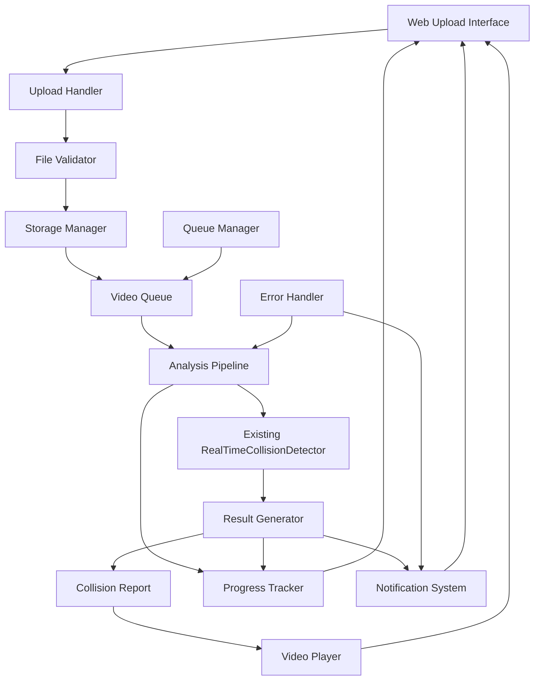

# Design Document: Video Upload Integration System

## Overview

The video upload integration system creates a seamless workflow for processing uploaded video files through the existing collision detection pipeline. The system extends the current collision detection infrastructure by adding a web-based upload interface, automated processing queue, and comprehensive result visualization.

The design leverages the existing `RealTimeCollisionDetector` class and collision detection algorithms, ensuring consistency between real-time and uploaded video analysis. The system provides a complete user experience from file upload through result visualization, with real-time progress tracking and comprehensive error handling.

## Architecture

The system extends the existing collision detection architecture with new upload and processing components:



The architecture maintains separation of concerns while integrating seamlessly with the existing collision detection system. The upload workflow is completely independent of real-time processing, allowing both to operate simultaneously.

## Components and Interfaces

### Web Interface Layer

**VideoUploadInterface Class** (JavaScript)
```javascript
class VideoUploadInterface {
  constructor(uploadElement, progressElement, resultsElement)
  initializeDragDrop()
  handleFileSelection(files)
  startUpload(file)
  displayProgress(progressData)
  showResults(analysisResults)
  handleErrors(errorData)
}
```

**ProgressTracker Class** (JavaScript)
```javascript
class ProgressTracker {
  constructor(progressElement)
  updateUploadProgress(percentage, estimatedTime)
  updateProcessingProgress(stage, frameNumber, totalFrames)
  updateQueueStatus(position, estimatedWait)
  showCompletionNotification(results)
}
```

**VideoResultsPlayer Class** (JavaScript)
```javascript
class VideoResultsPlayer {
  constructor(videoElement, controlsElement)
  loadProcessedVideo(videoUrl, collisionData)
  displayCollisionOverlays(timestamp, collisions)
  jumpToCollision(collisionIndex)
  exportResults(format)
}
```

### Backend Processing Layer

**UploadHandler Class** (Python)
```python
class UploadHandler:
    def __init__(self, storage_manager, file_validator)
    def handle_upload(self, file_data, user_session)
    def validate_file(self, file_data)
    def store_uploaded_file(self, file_data, file_id)
    def queue_for_processing(self, file_id, priority)
```

**VideoQueue Class** (Python)
```python
class VideoQueue:
    def __init__(self, max_concurrent_jobs)
    def add_video(self, video_id, file_path, priority)
    def get_next_video(self)
    def update_status(self, video_id, status, progress)
    def get_queue_position(self, video_id)
    def remove_completed(self, video_id)
```

**AnalysisPipeline Class** (Python)
```python
class AnalysisPipeline:
    def __init__(self, collision_detector, result_generator)
    def process_video(self, video_path, video_id)
    def update_progress(self, video_id, frame_number, total_frames)
    def handle_processing_error(self, video_id, error)
    def generate_final_results(self, video_id, collision_events)
```

**ResultGenerator Class** (Python)
```python
class ResultGenerator:
    def __init__(self, storage_manager)
    def create_collision_report(self, collision_events, video_metadata)
    def generate_processed_video(self, original_path, collision_data)
    def create_summary_statistics(self, collision_events)
    def export_results(self, video_id, format)
```

### Storage and File Management

**StorageManager Class** (Python)
```python
class StorageManager:
    def __init__(self, upload_dir, processed_dir, temp_dir)
    def store_uploaded_file(self, file_data, file_id)
    def get_file_path(self, file_id, file_type)
    def cleanup_temporary_files(self, file_id)
    def manage_storage_quota(self)
    def verify_file_integrity(self, file_path)
```

**FileValidator Class** (Python)
```python
class FileValidator:
    def __init__(self, max_file_size, allowed_formats)
    def validate_format(self, file_path)
    def validate_size(self, file_size)
    def validate_integrity(self, file_path)
    def get_video_metadata(self, file_path)
```

## Data Models

**UploadedVideo Structure**
```python
@dataclass
class UploadedVideo:
    id: str
    original_filename: str
    file_path: str
    file_size: int
    upload_timestamp: datetime
    user_session: str
    status: str  # 'uploaded', 'queued', 'processing', 'completed', 'failed'
    priority: int
```

**ProcessingJob Structure**
```python
@dataclass
class ProcessingJob:
    video_id: str
    status: str
    progress_percentage: float
    current_frame: int
    total_frames: int
    start_time: datetime
    estimated_completion: datetime
    error_message: Optional[str]
```

**VideoAnalysisResult Structure**
```python
@dataclass
class VideoAnalysisResult:
    video_id: str
    original_filename: str
    processing_duration: float
    total_frames: int
    collision_events: List[CollisionEvent]
    processed_video_path: str
    report_path: str
    summary_statistics: Dict[str, Any]
    completion_timestamp: datetime
```

**CollisionSummary Structure**
```python
@dataclass
class CollisionSummary:
    total_collisions: int
    collision_timestamps: List[float]
    object_types_involved: List[str]
    severity_distribution: Dict[str, int]
    average_confidence: float
    processing_fps: float
```

## Error Handling

The system implements comprehensive error handling across all processing stages:

**Upload Error Handling**
- File format validation with specific error messages for unsupported formats
- File size validation with clear size limit communication
- Network interruption recovery with automatic retry mechanisms
- Disk space validation before accepting uploads

**Processing Error Handling**
- Video corruption detection with detailed diagnostic information
- Memory overflow protection with automatic quality reduction
- Processing timeout handling with configurable time limits
- Model loading failure recovery with fallback detection algorithms

**Queue Management Error Handling**
- Queue overflow protection with user notification and wait time estimates
- Processing job failure recovery with automatic retry logic
- Resource exhaustion handling with intelligent job scheduling
- Concurrent processing limit enforcement to maintain system stability

**Storage Error Handling**
- File system error recovery with alternative storage locations
- Integrity check failures with automatic file re-upload requests
- Cleanup operation failures with manual intervention alerts
- Quota management with automatic old file removal

## Testing Strategy

The testing approach combines unit testing and property-based testing across the upload and processing pipeline:

**Unit Testing**
- File upload and validation component testing with mock file data
- Queue management testing with simulated processing loads
- Error handling validation with intentionally corrupted inputs
- Integration testing between upload interface and processing pipeline

**Property-Based Testing**
- Universal file validation properties using Hypothesis library for Python components
- Upload workflow properties using fast-check library for JavaScript components
- Minimum 100 iterations per property test
- Each test tagged with: **Feature: video-upload-integration, Property {number}: {property_text}**

**Integration Testing**
- End-to-end upload to results workflow testing
- Concurrent upload handling with multiple simultaneous users
- Queue processing under various load conditions
- Error recovery testing with simulated failures

**Performance Testing**
- Upload throughput benchmarking with various file sizes
- Processing pipeline performance measurement
- Memory usage profiling during video analysis
- Storage management efficiency validation

## Correctness Properties

*A property is a characteristic or behavior that should hold true across all valid executions of a system—essentially, a formal statement about what the system should do. Properties serve as the bridge between human-readable specifications and machine-verifiable correctness guarantees.*

The following properties define the correctness requirements for the video upload integration system:

### Property 1: File Format Validation Accuracy
*For any* uploaded file, the File_Validator should accept the file if and only if it has a valid format (MP4, AVI, MOV, WebM) and is under 500MB in size.
**Validates: Requirements 1.2**

### Property 2: Invalid File Rejection
*For any* invalid file (wrong format, too large, or corrupted), the File_Validator should reject the file and display a specific error message explaining the rejection reason.
**Validates: Requirements 1.3**

### Property 3: Upload Progress Tracking
*For any* file being uploaded, the Progress_Tracker should display accurate progress percentage and estimated completion time throughout the upload process.
**Validates: Requirements 1.4**

### Property 4: Upload Completion Processing
*For any* successfully uploaded video file, the Upload_Handler should confirm the upload and automatically add the video to the processing queue.
**Validates: Requirements 1.5, 2.1**

### Property 5: Automatic Processing Initiation
*For any* video in the processing queue, the Analysis_Pipeline should automatically run the collision detection algorithm when processing begins.
**Validates: Requirements 2.2**

### Property 6: Processing Progress Monitoring
*For any* video being processed, the Progress_Tracker should display current processing stage and frame-by-frame progress with accurate frame counts.
**Validates: Requirements 2.3, 3.1, 3.2**

### Property 7: Report Generation Completeness
*For any* completed video analysis, the Result_Generator should create a comprehensive collision report containing all detected collision events and summary statistics.
**Validates: Requirements 2.4, 4.1**

### Property 8: Error Logging and Notification
*For any* processing failure, the Analysis_Pipeline should log detailed error information and notify the user with specific failure reasons.
**Validates: Requirements 2.5**

### Property 9: Queue Position Tracking
*For any* set of queued videos, the Progress_Tracker should accurately display each video's queue position and estimated wait time.
**Validates: Requirements 3.3**

### Property 10: Completion Notification
*For any* video that completes processing, the Notification_System should immediately notify the user via the web interface.
**Validates: Requirements 3.4**

### Property 11: Status Update Frequency
*For any* active processing job, the Progress_Tracker should update status information at least every 2 seconds.
**Validates: Requirements 3.5**

### Property 12: Collision Event Highlighting
*For any* processed video with collision events, the Video_Player should display collision highlights at the exact timestamps where collisions were detected.
**Validates: Requirements 4.2**

### Property 13: Collision Report Detail Completeness
*For any* detected collision event, the Collision_Report should include precise timestamp, object types involved, and collision severity information.
**Validates: Requirements 4.3**

### Property 14: Collision Navigation
*For any* video with detected collision events, the Video_Player should allow users to jump directly to each collision timestamp.
**Validates: Requirements 4.5**

### Property 15: File Storage Management
*For any* uploaded video, the Storage_Manager should store the original file temporarily during processing and manage processed results according to configuration settings.
**Validates: Requirements 5.1, 5.2**

### Property 16: Storage Cleanup Automation
*For any* storage space constraint, the Storage_Manager should automatically clean up old processed videos to maintain available space.
**Validates: Requirements 5.3**

### Property 17: File Integrity Maintenance
*For any* file being processed, the Storage_Manager should maintain integrity checks to prevent corruption throughout the processing pipeline.
**Validates: Requirements 5.4**

### Property 18: Secure Download Access
*For any* user request for processed videos or reports, the Storage_Manager should provide secure access without compromising file integrity.
**Validates: Requirements 5.5**

### Property 19: FIFO Queue Processing
*For any* set of uploaded videos with equal priority, the Video_Queue should process them in first-in-first-out order.
**Validates: Requirements 6.1**

### Property 20: Resource-Limited Processing Control
*For any* system resource constraint, the Video_Queue should limit concurrent processing to maintain system performance.
**Validates: Requirements 6.2**

### Property 21: Priority Processing Support
*For any* high-priority video submission, the Video_Queue should process it before lower-priority videos in the queue.
**Validates: Requirements 6.3**

### Property 22: Duplicate Processing Prevention
*For any* set of video files, the Video_Queue should prevent duplicate processing of identical files.
**Validates: Requirements 6.4**

### Property 23: Queue Capacity Reporting
*For any* full queue condition, the Video_Queue should inform users of current capacity and provide estimated processing times.
**Validates: Requirements 6.5**

### Property 24: Corruption Detection
*For any* corrupted video file, the File_Validator should detect the corruption and provide specific error messages.
**Validates: Requirements 7.1**

### Property 25: Automatic Retry Logic
*For any* processing failure, the Analysis_Pipeline should attempt automatic retry up to 3 times before final failure.
**Validates: Requirements 7.2**

### Property 26: Final Error Handling
*For any* processing failure after retry exhaustion, the Analysis_Pipeline should log detailed error information and notify the user.
**Validates: Requirements 7.3**

### Property 27: Resource Insufficient Queueing
*For any* insufficient system resource condition, the Analysis_Pipeline should queue videos for later processing rather than failing immediately.
**Validates: Requirements 7.4**

### Property 28: Actionable Error Messages
*For any* error condition, the Notification_System should provide clear, actionable error messages that help users resolve issues.
**Validates: Requirements 7.5**

### Property 29: Collision Detector Integration
*For any* video processing operation, the Analysis_Pipeline should use the existing RealTimeCollisionDetector class without modification.
**Validates: Requirements 8.1**

### Property 30: Parameter Consistency
*For any* collision detection operation, the Analysis_Pipeline should apply the same detection parameters used for real-time processing.
**Validates: Requirements 8.2**

### Property 31: Data Structure Consistency
*For any* generated collision results, the Result_Generator should use the same collision event data structures as the real-time system.
**Validates: Requirements 8.3**

### Property 32: Hardware Integration Compatibility
*For any* collision detection results, the Analysis_Pipeline should maintain compatibility with existing ESP8266 hardware integration.
**Validates: Requirements 8.4**

### Property 33: Result Format Consistency
*For any* completed video processing, the Analysis_Pipeline should generate results in the same format as real-time collision detection.
**Validates: Requirements 8.5**